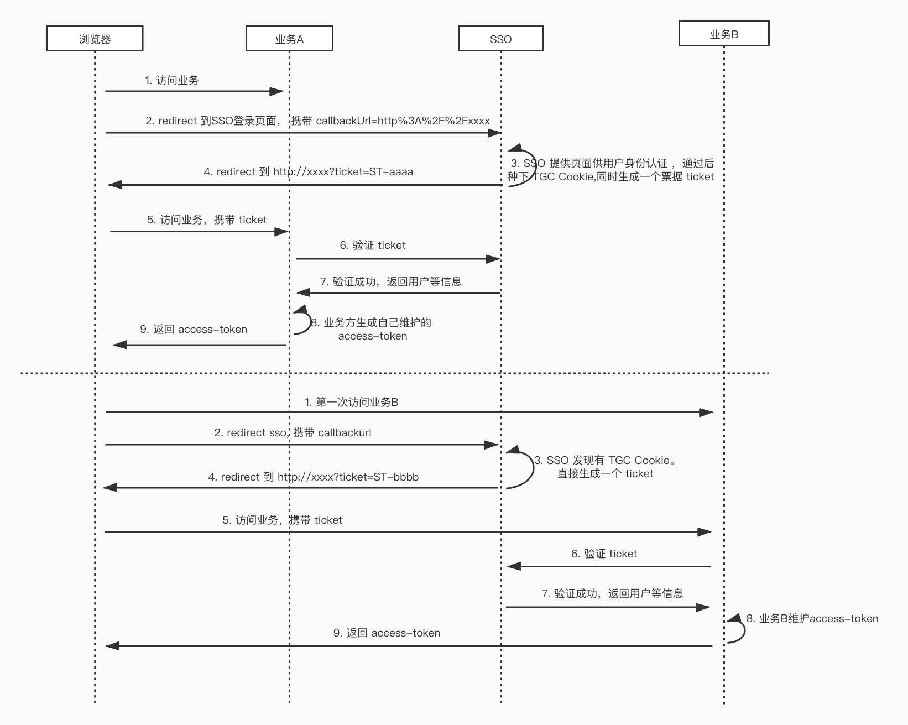

## SSO 单点登录系统



## 名词说明:

|       | TGT   | TGC  | ST  |
|  ---  |  ----  | ----  | ---- |
|  说明  | Server 端 Session  | 浏览器端 Cookie | 票据（根据此获取 TGT）  |
|  过期  | 14 天  | 10 天 | 10s  |

这里设计时，TGC 与 TGT 值相等。

## 接入前提
- 用户认证 基于 mysql，表在 db 目录下，需提前装好 Mysql 并初始化数据。
- TGT 对应的用户id 及 ST 票据对应的 TGT 存放在 redis 中，需提前装好 redis.
- sso-server 对业务应用只提供根据 ST 获取用户的功能。业务获取到用户后，需自定义会话状态

## 流程说明 （业务前后端分离情景）
1. 业务 Server 端发现没有登录态时，返回一个状态码，比如 401.
2. 业务前端请求拦截 401，跳转 SSO 主页，带上回调地址，比如: callbackUrl = http://app.xxx.com/callback
3. SSO 端内部判断（最终会重定向到回调地址，并携带 ST 票据）
    1. 如果没有获取本地 TGC (cookie)，表示没有登录过，内部重定向到 SSO 登录页
        - 用户输入账号，密码，登录成功后，会在该 SSO 站点重新种下 TGC，同时生成一个 ST，携带在业务前端给定的回调地址上。
    2. 如果获取到本地 TGC (cookie)，内部校验是否有效，无效也会重定向到 SSO 登录页，有效会生成一个 ST，携带在业务前端给定的回调地址上。
4. 业务前端回调地址页面收到 ST 后，发送给业务 Server 端。Server 端根据 ST 调用 SSO 接口 (可通过 sso-client 内部方法) ，获取用户。
5. Server 端拿到用户后，可自己建表保存，并与业务前端建立会话关系。

## client 接入 (SpringBoot)

1. 引入 maven 依赖
    ```xml
        <dependency>
            <groupId>com.github.mjd507</groupId>
            <artifactId>sso-client</artifactId>
            <version>1.0-SNAPSHOT</version>
        </dependency>
    ```
   
2. 配置 sso server 地址
    ```yaml
    sso:
      server-url: # 根据 sso-server 部署配置
    ```

3. 注入 SSOUserClient
    ```java
        @Autowired
        private SSOUserClient ssoUserClient;
    ```

4. 根据票据获取用户
     ```java
        SSOUser ssoUser = ssoUserClient.getUser(ST)
    ```
 